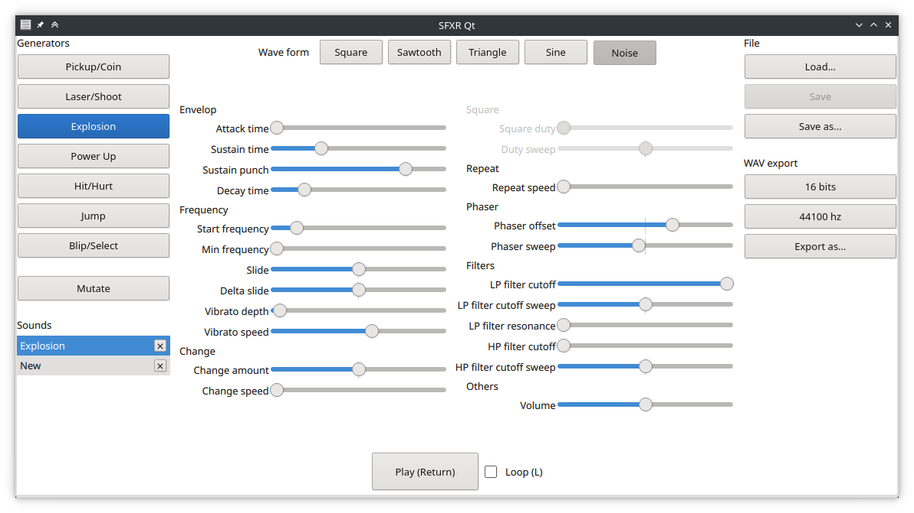

# SFXR Qt

This a QtQuick Controls 2 port of [SFXR][]. SFXR is a sound effect generator
created by DrPetter to quickly produce retro-sounding sound effects for games.

This project has the same features as the original SFXR, with a more modern
user interface and, dare I say, a more modular code base. Meaning DrPetter did
all the hard work, I just refactored and plugged a new UI on top of it.

## Usage

Start the application and click on one of the generator buttons. Then play with
the sliders to produce the sound you want. When you are happy with the result,
use the "Export as..." button to create a wav file, or the "Save as..." button
to save it in SFXR format, so that you can work on it later.

For more details, you should read the original [SFXR
readme.txt](readme-sfxr-sdl.txt).

## Building

Building SFXR Qt requires the following:

- Qt 5.7
- SDL 1.2
- Python 3 (The application is written in C++ and does not depend on Python,
  but a part of the build system does)
- CMake 3.7 (You might be able to build with older versions if you adjust the
  minimum version in the `CMakeLists.txt` file, let me know if you do)

Get the `qpropgen` Git submodule with:

    git submodule update --init

Then create a build directory:

    mkdir build

Finally, build and install:

    cd build
    cmake ..
    ninja
    sudo ninja install

## License

MIT

[SFXR]: http://www.drpetter.se/project_sfxr.html
